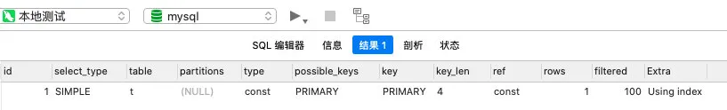
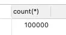
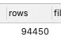
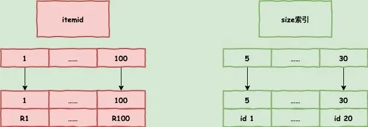
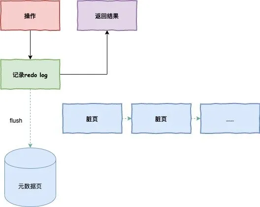
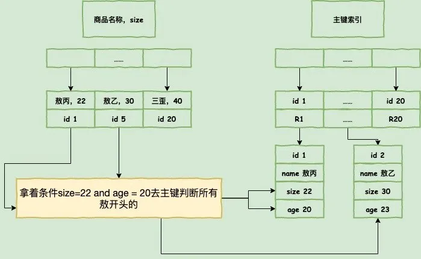
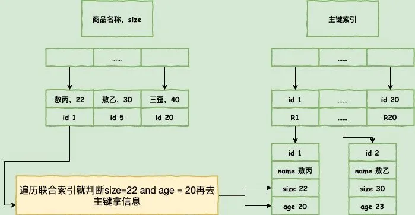

[toc]

# 数据库调优


## 排除缓存干扰

在MySQL8.0之前的数据库是存在缓存这样的情况的,因为存在缓存，我发现我sql怎么执行都是很快，当然第一次其实不快但是我没注意到，以至于上线后因为缓存经常失效，导致rt（Response time）时高时低。

后面就发现了是缓存的问题，我们在执行SQL的时候，记得加上SQL NoCache去跑SQL，这样跑出来的时间就是真实的查询时间了。

我说一下为什么缓存会失效，而且是经常失效。

如果我们当前的MySQL版本支持缓存而且我们又开启了缓存，那每次请求的查询语句和结果都会以key-value的形式缓存在内存中的，大家也看到我们的结构图了，一个请求会先去看缓存是否存在，不存在才会走解析器。

缓存失效比较频繁的原因就是，只要我们一对表进行更新，那这个表所有的缓存都会被清空，其实我们很少存在不更新的表，特别是我之前的电商场景，可能静态表可以用到缓存，但是我们都走大数据离线分析，缓存也就没用了。

如果是8.0以上的版本就不用担心这个问题，如果是8.0之下的版本，记得排除缓存的干扰。

## Explain

**sql中Explain命令详解可以看**：https://www.cnblogs.com/leeego-123/p/11846613.html

最开始提到了用执行计划去分析，我想explain是大家SQL调优都会回答到的吧。

因为这基本上是写SQL的必备操作，那我现在问大家一个我去阿里面试被问过的一个问题：**explain你记得哪些字段，分别有什么含义？**

当时我就回答上来三个，我默认大家都是有数据库基础的，所以每个我这里不具体讨论每个字段，怕大家忘记我贴一遍图大家自己回忆一下。



**那我再问大家一下，你们认为统计这个统计的行数就是完全对的么？索引一定会走到最优索引么？**

当然我都这么问了，你们肯定也知道结果了，行数只是一个接近的数字，不是完全正确的，索引也不一定就是走最优的，是可能走错的。

我的总行数大概有10W行，但是我去用explain去分析sql的时候，就会发现只得到了9.4W，为啥行数只是个近视值呢？





MySQL中数据的单位都是页，MySQL又采用了采样统计的方法，采样统计的时候，InnoDB默认会选择N个数据页，统计这些页面上的不同值，得到一个平均值，然后乘以这个索引的页面数，就得到了这个索引的基数。

我们数据是一直在变的，所以索引的统计信息也是会变的，会根据一个阈值，重新做统计。

至于MySQL索引可能走错也很好理解，如果走A索引要扫描100行，B索引只要20行，但是他可能选择走A索引，你可能会想MySQL是不是有病啊，其实不是的。

一般走错都是因为优化器在选择的时候发现，走A索引没有额外的代价，比如走B索引并不能直接拿到我们的值，还需要回到主键索引才可以拿到，多了一次回表的过程，这个也是会被优化器考虑进去的。

他发现走A索引不需要回表，没有额外的开销，所有他选错了。

如果是上面的统计信息错了，那简单，我们用analyze table tablename 就可以重新统计索引信息了，所以在实践中，如果你发现explain的结果预估的rows值跟实际情况差距比较大，可以采用这个方法来处理。

还有一个方法就是force index强制走正确的索引，或者优化SQL，最后实在不行，可以新建索引，或者删掉错误的索引。

## 覆盖索引

上面我提到了，可能需要回表这样的操作，那我们怎么能做到不回表呢？在自己的索引上就查到自己想要的，不要去主键索引查了。

覆盖索引

如果在我们建立的索引上就已经有我们需要的字段，就不需要回表了，在电商里面也是很常见的，我们需要去商品表通过各种信息查询到商品id，id一般都是主键，可能sql类似这样：

```mysql
select itemId from itemCenter where size between 1 and 6
```



因为商品id itemId一般都是主键，在size索引上肯定会有我们这个值，这个时候就不需要回主键表去查询id信息了。

由于覆盖索引可以减少树的搜索次数，显著提升查询性能，所以使用覆盖索引是一个常用的性能优化手段。

**详细讲解**可以查看：https://juejin.im/post/6844904062329028621

## 联合索引

还是商品表举例，我们需要根据他的名称，去查他的库存，假设这是一个很高频的查询请求，你会怎么建立索引呢？

大家可以思考上面的回表的消耗对SQL进行优化。

是的建立一个，名称和库存的联合索引，这样名称查出来就可以看到库存了，不需要查出id之后去回表再查询库存了，联合索引在我们开发过程中也是常见的，但是并不是可以一直建立的，大家要思考索引占据的空间。


刚才我举的例子其实有点生硬，正常通过商品名称去查询库存的请求是不多的，但是也不代表没有哈，真来了，难道我们去全表扫描？

## 最左匹配原则

大家在写sql的时候，最好能利用到现有的SQL最大化利用，像上面的场景，如果利用一个模糊查询 itemname like ’敖丙%‘，这样还是能利用到这个索引的，而且如果有这样的联合索引，大家也没必要去新建一个商品名称单独的索引了。

很多时候我们索引可能没建对，那你调整一下顺序，可能就可以优化到整个SQL了

## 前缀索引

**前缀索引**可以看：

* https://www.begtut.com/mysql/mysql-prefix-index.html
* https://www.jianshu.com/p/b298716108a8

我们存在邮箱作为用户名的情况，每个人的邮箱都是不一样的，那我们是不是可以在邮箱上建立索引，但是邮箱这么长，我们怎么去建立索引呢？

MySQL是支持前缀索引的，也就是说，你可以定义字符串的一部分作为索引。默认地，如果你创建索引的语句不指定前缀长度，那么索引就会包含整个字符串。

**我们是否可以建立一个区分度很高的前缀索引，达到优化和节约空间的目的呢？**

使用前缀索引，定义好长度，就可以做到既节省空间，又不用额外增加太多的查询成本。

上面说过覆盖索引了，覆盖索引是不需要回表的，但是前缀索引，即使你的联合索引已经包涵了相关信息，他还是会回表，因为他不确定你到底是不是一个完整的信息，就算你是www.aobing@mogu.com一个完整的邮箱去查询，他还是不知道你是否是完整的，所以他需要回表去判断一下。

**下面这个也是我在阿里面试面试官问过我的，很长的字段，想做索引我们怎么去优化他呢？**

因为存在一个磁盘占用的问题，索引选取的越长，占用的磁盘空间就越大，相同的数据页能放下的索引值就越少，搜索的效率也就会越低。

我当时就回答了一个hash，把字段hash为另外一个字段存起来，每次校验hash就好了，hash的索引也不大。

我们都知道只要区分度过高，都可以，那我们可以采用倒序，或者删减字符串这样的情况去建立我们自己的区分度，不过大家需要注意的是，调用函数也是一次开销哟，这点当时没注意。

就比如本来是www.aobing@qq,com 其实前面的`www.`基本上是没任何区分度的，所有人的邮箱都是这么开头的，你一搜一大堆出来，放在索引还浪费内存，你可以substring()函数截取掉前面的，然后建立索引。

我们所有人的身份证都是区域开头的，同区域的人很多，那怎么做良好的区分呢？REVERSE（）函数翻转一下，区分度可能就高了。

这些操作都用到了函数，我就说一下函数的坑。

## 条件字段函数操作

日常开发过程中，大家经常对很多字段进行函数操作，如果对日期字段操作，浮点字符操作等等，大家需要注意的是，如果对字段做了函数计算，就用不上索引了，这是MySQL的规定。

对索引字段做函数操作，可能会破坏索引值的有序性，因此优化器就决定放弃走树搜索功能。

需要注意的是，优化器并不是要放弃使用这个索引。

这个时候大家可以用一些取巧的方法，比如 select * from tradelog where id + 1 = 10000 就走不上索引，select * from tradelog where id = 9999就可以。

#### 隐式类型转换

select * from t where id = 1

如果id是字符类型的，1是数字类型的，你用explain会发现走了全表扫描，根本用不上索引，为啥呢？

因为MySQL底层会对你的比较进行转换，相当于加了 CAST( id AS signed int) 这样的一个函数，上面说过函数会导致走不上索引。

## 隐式字符编码转换

还是一样的问题，如果两个表的字符集不一样，一个是utf8mb4，一个是utf8，因为utf8mb4是utf8的超集，所以一旦两个字符比较，就会转换为utf8mb4再比较。

转换的过程相当于加了CONVERT(id USING utf8mb4)函数，那又回到上面的问题了，用到函数就用不上索引了。

还有大家一会可能会遇到mysql突然卡顿的情况，那可能是MySQLflush了。

## flush

redo log大家都知道，也就是我们对数据库操作的日志，他是在内存中的，每次操作一旦写了redo log就会立马返回结果，但是这个redo log总会找个时间去更新到磁盘，这个操作就是flush。

在更新之前，当内存数据页跟磁盘数据页内容不一致的时候，我们称这个内存页为“脏页”。

内存数据写入到磁盘后，内存和磁盘上的数据页的内容就一致了，称为“干净页“。

**那什么时候会flush呢？**

1. InnoDB的redo log写满了，这时候系统会停止所有更新操作，把checkpoint往前推进，redo log留出空间可以继续写。
2. 系统内存不足，当需要新的内存页，而内存不够用的时候，就要淘汰一些数据页，空出内存给别的数据页使用。如果淘汰的是“脏页”，就要先将脏页写到磁盘。

> 你一定会说，这时候难道不能直接把内存淘汰掉，下次需要请求的时候，从磁盘读入数据页，然后拿redo log出来应用不就行了？

这里其实是从性能考虑的，如果刷脏页一定会写盘，就保证了每个数据页有两种状态：

- 一种是内存里存在，内存里就肯定是正确的结果，直接返回；
- 另一种是内存里没有数据，就可以肯定数据文件上是正确的结果，读入内存后返回。这样的效率最高。

1. MySQL认为系统“空闲”的时候，只要有机会就刷一点“脏页”。
2. MySQL正常关闭，这时候，MySQL会把内存的脏页都flush到磁盘上，这样下次MySQL启动的时候，就可以直接从磁盘上读数据，启动速度会很快。


**那我们怎么做才能把握flush的时机呢？**

Innodb刷脏页控制策略，我们每个电脑主机的io能力是不一样的，你要正确地告诉InnoDB所在主机的IO能力，这样InnoDB才能知道需要全力刷脏页的时候，可以刷多快。

这就要用到innodb_io_capacity这个参数了，它会告诉InnoDB你的磁盘能力，这个值建议设置成磁盘的IOPS，磁盘的IOPS可以通过fio这个工具来测试。

正确地设置innodb_io_capacity参数，可以有效的解决这个问题。

这中间有个有意思的点，刷脏页的时候，旁边如果也是脏页，会一起刷掉的，并且如果周围还有脏页，这个连带责任制会一直蔓延，这种情况其实在机械硬盘时代比较好，一次IO就解决了所有问题，



但是现在都是固态硬盘了，innodb_flush_neighbors=0这个参数可以不产生连带制，在MySQL 8.0中，innodb_flush_neighbors参数的默认值已经是0了。

## 索引下推

你已经知道了前缀索引规则，那我就说一个官方帮我们优化的东西，索引下推。

```mysql
select * from itemcenter where name like '敖%' and size=22 and age = 20;
```

所以这个语句在搜索索引树的时候，只能用 “敖”，找到第一个满足条件的记录ID1，当然，这还不错，总比全表扫描要好。

然后呢？

当然是判断其他条件是否满足，比如size。

在MySQL 5.6之前，只能从ID1开始一个个回表，到主键索引上找出数据行，再对比字段值。



而MySQL 5.6 引入的索引下推优化（index condition pushdown)， 可以在索引遍历过程中，对索引中包含的字段先做判断，直接过滤掉不满足条件的记录，减少回表次数。



## 唯一索引普通索引选择难题

核心是需要回答到change buffer，那change buffer又是个什么东西呢？

当需要更新一个数据页时，如果数据页在内存中就直接更新，而如果这个数据页还没有在内存中的话，在不影响数据一致性的前提下，InooDB会将这些更新操作缓存在change buffer中，这样就不需要从磁盘中读入这个数据页了。

在下次查询需要访问这个数据页的时候，将数据页读入内存，然后执行change buffer中与这个页有关的操作，通过这种方式就能保证这个数据逻辑的正确性。

需要说明的是，虽然名字叫作change buffer，实际上它是可以持久化的数据。也就是说，change buffer在内存中有拷贝，也会被写入到磁盘上。

将change buffer中的操作应用到原数据页，得到最新结果的过程称为merge。

除了访问这个数据页会触发merge外，系统有后台线程会定期merge。在数据库正常关闭（shutdown）的过程中，也会执行merge操作。


显然，如果能够将更新操作先记录在change buffer，减少读磁盘，语句的执行速度会得到明显的提升。而且，数据读入内存是需要占用buffer pool的，所以这种方式还能够避免占用内存，提高内存利用率

那么，**什么条件下可以使用change buffer呢？**

对于唯一索引来说，所有的更新操作都要先判断这个操作是否违反唯一性约束。

要判断表中是否存在这个数据，而这必须要将数据页读入内存才能判断，如果都已经读入到内存了，那直接更新内存会更快，就没必要使用change buffer了。

因此，唯一索引的更新就不能使用change buffer，实际上也只有普通索引可以使用。

change buffer用的是buffer pool里的内存，因此不能无限增大，change buffer的大小，可以通过参数innodb_change_buffer_max_size来动态设置，这个参数设置为50的时候，表示change buffer的大小最多只能占用buffer pool的50%。

将数据从磁盘读入内存涉及随机IO的访问，是数据库里面成本最高的操作之一，change buffer因为减少了随机磁盘访问，所以对更新性能的提升是会很明显的。

#### change buffer的使用场景

因为merge的时候是真正进行数据更新的时刻，而change buffer的主要目的就是将记录的变更动作缓存下来，所以在一个数据页做merge之前，change buffer记录的变更越多（也就是这个页面上要更新的次数越多），收益就越大。

因此，对于写多读少的业务来说，页面在写完以后马上被访问到的概率比较小，此时change buffer的使用效果最好，这种业务模型常见的就是账单类、日志类的系统。

反过来，假设一个业务的更新模式是写入之后马上会做查询，那么即使满足了条件，将更新先记录在change buffer，但之后由于马上要访问这个数据页，会立即触发merge过程。这样随机访问IO的次数不会减少，反而增加了change buffer的维护代价，所以，对于这种业务模式来说，change buffer反而起到了副作用。


**转载自：**

* https://mp.weixin.qq.com/s/e0CqJG2-PCDgKLjQfh02tw