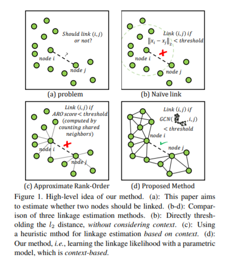
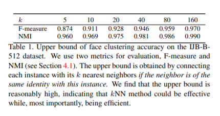
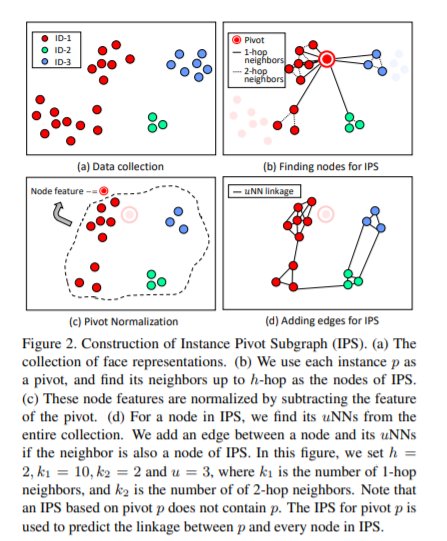
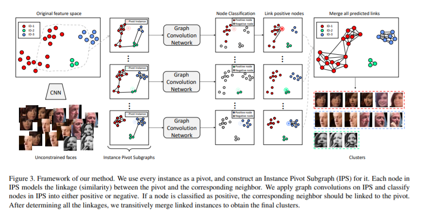
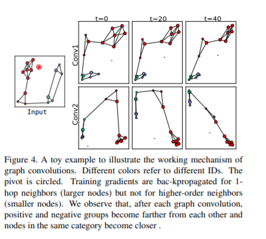
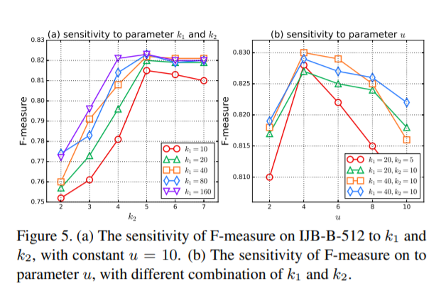
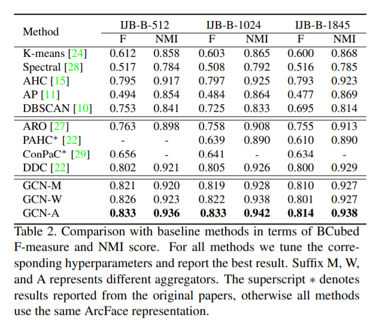
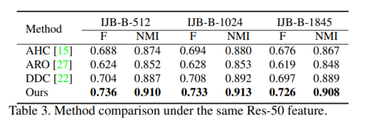
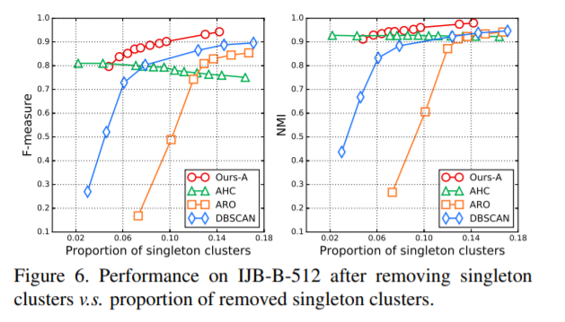
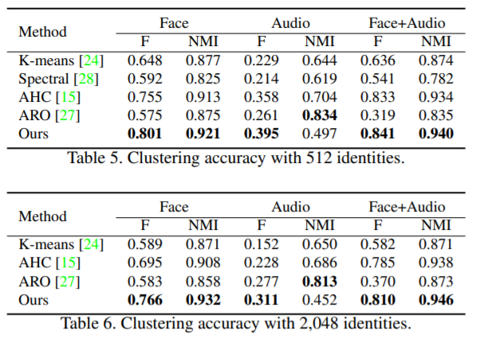

# 《Linkage Based Face Clustering via Graph Convolution Network》学习

## 摘要

在本文中，我们提出了一种准确且可扩展的面部聚类任务方法。我们的目标是将由他们的潜在身份构成的面孔。我们制定这个任务作为链接预测问题：两个之间存在链接具有相同身份的面孔。关键思想是我们发现实例（面）周围的特征空间中的本地上下文包含有关此实例与其邻居之间的链接关系的丰富信息。通过围绕每个实例构造子图作为输入数据，它描述了局部上下文，我们利用图卷积网络（GCN）进行推理并推断子图中线对之间链接的可能性。实验表明，与传统方法相比，我们的方法对于复杂的人脸分布更为稳健，与标准人脸聚类基准上的最新方法相比，可产生令人满意的可比结果，并且可扩展到大型数据集。此外，我们证明了所提出的方法不需要像以前那样的簇数，知道噪音和离群值，可以扩展到多视图版本可提供更准确的聚类精度。

## 1.介绍

在本文中，我们研究了人脸聚类的问题根据他们的基本身份。 我们假设没有面部表情或身份数量的分布之前。 人脸聚类是脸部分析，之前已经进行了广泛的研究作品[38，27，22，29]。 一些关键应用包括：在桌面/在线相册中对面孔进行分组和标记用于照片管理[38]，组织大规模的面部图像/视频集合，以便在时间敏感的情况下快速检索
取证调查[19]等场景，以及自动数据清理/标记以构建大规模数据集[26、12、34]。

常规的聚类方法受面部表示的复杂分布的困扰，因为它们对数据分布做出不切实际的假设。例如，K-Means [24]要求簇为凸形，频谱聚类[28]需要不同的聚类来平衡实例数，而DBSCAN [10]假设不同的聚类具有相同的密度。相反，基于链接的聚类方法系列没有假设数据分布并达到更高的准确性。如图1（a）所示，基于链接的方法旨在预测是否应链接两个节点（或群集）（具有相同的身份）。图1（b）通过直接链接其节点对来提供针对该问题的幼稚解决方案。l2距离在一定阈值以下。这显然是这不是一个好的解决方案，因为簇的密度会变化很多。因此，更复杂的指标旨在计算链接可能性，例如“近似”等级顺序距离（见图1（c））。

而不是通过启发式计算链接可能性指标，我们建议学习预测两个节点是否应该被链接。 作为这项工作的关键思想，我们发现节点与其邻居之间的链接可能性为从其上下文推断。 为了利用宝贵的在节点上下文中的信息，我们提出了一个可学习的图卷积网络的聚类方法（GCN），其主要思想如图1（d）所示。 所提出的方法的框架可以概括如下。

首先，我们将聚类公式化为链接预测问题[36]。 也就是说，当以下情况时，两个节点之间存在链接它们的身份标签是相同的。 其次，我们只预测实例与其最近的邻居之间的链接。 因此，我们围绕构建一个“实例数据透视图子图”每个实例（枢轴），以描述本地上下文，每个实例节点对枢轴-邻居对建模。 从IPS，我们可以执行推理以推断哪个枢轴邻居对应该链接起来，我们采用GCN来学习此任务。 最后，GCN会输出一组关联可能性，我们会传递合并链接的节点以获得群集。

我们证明了该方法在以下情况下是准确的与最先进的方法相比，可在计算复杂性方面进行扩展。 建议方法学习自动生成链接可能性，与其他基于链接的链接相比，具有更高的性能像ARO [27]这样的方法，其中链接可能性为由启发式规则计算。 另外，我们的方法是意识到噪音和离群值，不需要数量聚类为输入，并且易于扩展到多视图利用来自不同来源的数据的版本。

本文的其余部分安排如下。首先，我们简要回顾一下第2节中的相关工作。然后，第3节介绍了提出的聚类算法。 实验结果列在第4和结论在第5节中给出。

## 2.相关工作

**人脸聚类**。由于姿势，遮挡，照明和实例数量的巨大差异，脸部聚类大小，形状和密度有很大不同。复杂人脸表征的分布使其不适合应用经典的聚类算法，例如K-Means [24]和频谱聚类[28]，因为这些方法具有刚性数据分配的假设。几篇论文发表集聚层次的聚类算法聚类（AHC）[38，22，23]，在对具有复杂分布的数据进行分组方面非常强大。 Lin等。 [23]提出了邻近感知层次聚类（PAHC）该算法利用线性SVM对局部正实例和局部负实例进行分类。朱等。 [38]提出了一个名为Rank-Order distance的集群级亲和力替换原始的l1 / l2距离，并展示其滤除噪声/离群值的能力。 Lin等。 [22]还使用SVDD [30]设计了密度感知群集级别的相似性。处理密度不平衡的数据。以上所有方法在不受约束的面部聚类上表现出良好的性能，但是它们的计算复杂性仍然是一个问题，限制了它们在大规模集群中的应用。

幸运的是，近似秩序聚类（ARO）[27]提供了一个有效的大规模框架聚类。 ARO旨在预测节点是否应与它的k个最近邻居（kNN）关联，并传递合并所有链接对。 因此，ARO的计算复杂度仅为O（kn）。 kNN搜索过程可以大约最近的邻居也会加速（ANN）搜索算法。 因此，总体复杂度为O（nlogn）或O（n2），取决于我们是否设置了k
作为常数或让它随n增加。 ARO远不止这些比基于AHC的算法有效。 Shi等。 [29]也采用ANN将其ConPac算法扩展到可扩展版。 在这项工作中，由于所提出的方法是基于在kNN上，也适合使用此框架。

**链接预测**是社交网络分析中的关键问题[21、1、20、25、36]。 给定一个复杂的网络以图表的形式组织，目标是预测两个成员节点之间的链接。 估计可能性链接，以前的一些作品（如PageRank [4]和SimRank [16]）分析了整个图，而其他作品，如优先附件[3]和资源分配[37]，仅从节点的给定节点计算链接可能性邻居。 Zhang and Chen [35，36]认为仅从节点对的本地邻居计算链接似然性就足够了，并提出了Weisfeiler-Lehman神经网络机器[35]和图神经网络[36]从局部子图学习一般的图结构特征。 它是与我们的工作紧密相关，因为聚类任务可以简化为链接预测问题，并且我们还利用图神经网络可从局部图学习。

**图卷积网络（GCN）**。在许多机器学习问题中，输入可以组织为图。大量的研究工作[5，8，18，31，13]致力于设计用于图结构数据的卷积神经网络。根据对图数据的卷积定义，可以对GCN进行分类分为频谱方法和空间方。基于光谱GCN [5、8、18]基于图推广卷积傅立叶变换，而基于空间的GCN [31，13]直接在图上执行手动定义的卷积节点及其邻居。在应用方面，GCN可以处理两种转换设置中的问题[8，18]和感应设置[13，31]。在转换设置中，训练数据和测试数据是同一固定节点图，而在归纳设置中，模型需要跨不同的图进行推理。在这项工作中，我们建议基于空间的GCN以解决链接预测问题。的设计的GCN在归纳设置中执行图节点分类。

## 3.拟议方法

### 3.1总览

**问题定义**。 假设我们具有人脸图像集合的特征$X = [x_1,...,x_N]^T\in R^{N\times D}$，其中$N$是图像数，$D$是特征的维数，人脸聚类的目标是分配一个伪标签$y_i$到每个$i\in\{1,2，...，N\}$具有相同伪标签的实例构成一个集群。 至解决此问题，我们遵循基于链接的聚类范例，旨在预测实例对之间链接的可能性。 因此，集群是由链接对连接的所有实例之间组成。

**动机**。 这项工作的动机是我们发现我们只需要计算一个实例与其k个最近邻居之间的链接可能性，就足以产生一个不错的聚类结果。 在表1中，我们显示了不同k值的聚类性能的上限。 为了获得上限，我们直接如果邻居是属于该实例的，则用其kNN连接每个实例与该实例相同的身份。 结果表明在各种k值下，上限非常高。 这个表明预测联系的潜在有效性在实例及其kNN之间，而不是在所有潜在对之间。 采用这种策略的优点是我们可以获得相当高的聚类精度同时该系统具有高效的优势。

**管道**。 这项工作着重于面部聚类系统的效率和准确性。 所以我们采纳了这个想法实例与其kNN之间的关联的预测。由于预测链接基于其上下文，因此为了使链接预测可能准确，我们设计了一个名为Instance Pivot Subgraphs（IPS）的局部结构。 IPS是一个以枢纽实例p为中心的子图。 IPS由节点组成，包括p的kNN和高阶达到p的h跳。 重要的是，我们减去来自所有这些节点的枢轴p的特征，以便每个结果节点特征对a之间的链接关系进行编码枢轴邻居对。 我们在以下三个步骤中介绍了该方法的框架，图3给出了一个示例：

* 我们将每个实例用作枢轴，并为其构造一个实例枢轴子图（IPS）。 的建设IPS在第3.2节中有详细描述
* 给定IPS作为输入数据，我们应用图卷积网络（GCN）进行推理输出每个节点的得分，即链接可能性在相应的枢轴-邻居对之间。 GCN的机制在第3.3节中介绍。
* 以上步骤输出了一组加权边整个图，权重是链接可能性。 最后，根据链接的可能性，将链接的实例可传递地合并到群集中。 详细信息请参见第3.4节。

### 3.2实例数据透视图子图的构造

我们基于图中的上下文估计两个面部图像（节点）之间的链接可能性。 在本文中，我们建议构造Instance Pivot子图（IPS）作为上下文。 IPS由三个步骤生成。 首先，我们找到IPS的所有节点。 然后，我们将节点标准化通过减去枢轴的特征获得特征。 最后，我们在节点之间添加边。 实例数据透视图子图的生成如图2所示。

**步骤1：**节点发现。 给定枢轴$p$，我们使用它的作为IPS的节点，邻居最多可达$h-hop$。 对于每一跳，挑选的最近邻居的数量可能会有所不同。 我们表示第$i-th$中最接近的邻居数为$k_i,i=1，2，...，h$。 例如，假设$p$为枢纽，则节点集$V_p$为$h = 3且k_1 = 8,k_2 = 4,k_3 = 2$的IPS:$G_p(V_p，E_p)$由p的8个最近邻居，4个最近的邻居组成每个1跳邻居和2个最近邻居两跳邻居。 请注意，枢轴p本身已被排除来自$V_p$。 当我们这样做时，高阶邻居会提供上下文局部结构的辅助信息在枢轴及其邻居之间。 例如，对于$p$和如果$q$的kNN一直很远，则它的邻居$q$之一远离$p$，则$p$和$q$之间的连锁可能性为预期很小

**步骤2：**节点功能标准化。 现在我们有了枢纽实例$p$，节点集$V_p$及其节点特征$x_p$和$\{x_q | q\in V_p\}$。 为了将枢轴信息编码为IPS的节点功能，我们将节点标准化减去$x_p$
$$
F_p=[...,x_q-x_p,..]^T,for\ all	\ q\in V_p 		\text {	(1)}
$$
我们用$F_p\in R^{|V_p|×D}$表示归一化节点功能。 IPS中的一个节点功能是残差矢量在枢轴$p$的特征和对应的邻居

**步骤3：**在节点之间添加边。 最后一步是在节点之间添加边缘。 对于节点$q\in V_p$，我们首先找到所有实例中最靠近的$u$在原始的整个收藏中。 如果$uNNs$的节点$r$出现在$V_p$中，则将边$(q,r)$添加到边集$E_p$中。此过程可确保节点的程度不变太多了。 最后，我们代表了拓扑结构邻接矩阵$A_p\in R|V_p|\times|V_p|$的IPS和节点特征矩阵$F_p$。 此后我们忽略下标$p$。

### 3.3 IPS上的图卷积

IPS中包含的上下文（节点之间的边缘）对于确定节点是否为正值非常有价值（应链接到数据透视表）或否定（不应链接到枢）。 为了利用它，我们应用了图卷积网络（GCN）[18]，并做了一些修改以在IPS上执行推理。 图卷积层将a作为输入节点特征矩阵X与邻接矩阵A并输出变换后的节点特征矩阵Y。 在里面第一层，输入节点特征矩阵是原始节点特征矩阵$X =F$。形式上是图卷积在我们的情况下，层具有以下公式：
$$
Y=\sigma([X||GX]W)	\text {	(2)}
$$
其中$X\in R^{N\times d_{in}},Y\in R^{N\times d_{out}}$，N是数节点，以及$d_{in},d_{out}$是输入/输出的维度节点特征。$G = g(X,A)$是一个聚合矩阵大小$N\times N$，每行的总和为1，$g(·)$是$X$和$A$的函数。运算符 $||$ 表示矩阵沿要素维度的串联。 $W$是图卷积层大小的可学习权重矩阵$2d_{in}\times d_{out}$，而$\sigma(·)$是非线性激活函数。

图卷积运算可以分解分为两个步骤。 第一步，将$X$乘以$G$，就可以得出节点邻居的基础信息。 然后，将输入节点特征$X$串联在一起以及沿着要素维度的汇总信息$GX$。 在第二步中，串联的特征是由一组线性滤波器转换，其参数$W$有待学习。 以下三种策略$g(·) $探索聚合操作。

* **平均聚集**。聚集矩阵$G=\Lambda^{-\frac {1} {2}}A\Lambda^{-\frac {1} {2}}$,其中$A$是邻接矩阵,$\Lambda$是对角矩阵，$\Lambda_{ii}= \sum_{j}{A_{ij}}$,均值
  聚合在邻居之间执行平均池化
* **加权汇总**。 我们用对应的余弦相似度替换A中的每个非零元素，并使用softmax函数将这些非零归一化每行的值。 加权聚合在邻居之间执行加权平均池化。
* **Attention Aggregation**.类似于图注意力网络(attention network)[31]，我们尝试学习邻居的聚集权重。 也就是说，$G$是由两层MLP使用一对枢轴邻居节点的特征作为输入来生成的。 的MLP是端到端的培训。 注意聚合在邻居之间执行加权平均池化，自动学习权重的地方。

本文使用的GCN是四个图形的堆栈ReLU功能激活的卷积层。 我们然后在softmax激活后使用交叉熵损失作为优化的目标函数。在实践中，我们仅反向传播1跳节点的梯度邻居，因为我们只考虑了枢纽及其1跳邻居。 这种策略不仅导致与完全监督的情况相比，具有相当大的加速度，但也带来了准确性的提高。 原因是高阶邻居大多是负面的，所以正向和负向样本在1跳中更平衡邻居比所有邻居都多。 为了测试，我们只在1跳节点上也执行节点分类。

为了演示图卷积的工作机制，我们设计了一个具有二维输入节点特征和两个图卷积层的玩具示例。 每层的输出尺寸d1和d2设置为2以进行可视化目的。 在图4中，我们显示了输出嵌入的方式每层中的训练随训练迭代而变化。每张图之后卷积层，正节点（红色）分组更近，负节点（蓝色和绿色）组成另一个组。这是因为邻居的消息传递到节点在聚合步骤中，以及来自邻居的消息充当拉动链接的嵌入的平滑度节点连接在一起，就像这些节点通过弹簧连接一样。同时，监督信号将小组推开正节点和负节点组。 最后，系统达到平衡点，正负基团彼此远离，并且同一类别均关闭

### 3.4链接合并

要将聚类应用于面部数据集合，我们循环在所有实例上，使用每个实例构造一个IPS枢纽，并预测连锁的可能性（softmax所涉及实例与枢纽之间的节点分类器输出的概率）。因此，我们有一组边缘由链接可能性加权。要获取聚类，一种简单的方法是剪切其权重的所有边缘低于某个阈值并使用“呼吸优先搜索”（BFS）传播伪标签，如图3所示。但是，性能会受到阈值的敏感影响值。因此，我们采用伪标签传播[34]中提出的策略。在每次迭代中，算法将边缘切割到某个阈值以下并保持连接大小大于预定最大值的集群要在下一次迭代中处理的队列中的大小。在里面在下一次迭代中，提高切削刃的阈值。重复此过程，直到队列为空为止。表示所有实例都用伪标签标记

## 4.实验

### 4.1 评估指标和数据集

为了评估所提出的聚类算法的性能，我们采用了两种主流的评估指标：归一化互信息（NMI）和BCubed F-measure [2]。 给定$\Omega$地面真理簇集(the ground truth cluster set)，$C$预测群集集,NMI定义为:
$$
NMI(\Omega,C)=\frac {I(\Omega,C)} {\sqrt{H(\Omega)H(C)}} \text {	(3)}
$$
其中$H(\Omega)$和$H(C)$代表$\Omega$和$C$的熵，而$I(\Omega,C)$代表共同信息（mutual information）。

BCubed F-measure [2]是更实用的度量同时兼顾精度和召回率。让我们将$L(i)$和$C(i)$表示为基本事实标签，并且首先，我们首先将成对标签定义为:
$$
Correct(i,j)=
		\begin{cases}
        1,  & \text{if L(i)=L(j) and C(i)=C(j)} \\
        0, & \text{otherwise}
        \end{cases}					(4)
$$
BCubed 准确度(Precision) P和BCubed 召回率(Recall) R分别定义为:
$$
P = E_i[E_{j:C(j)=C(i)}[Correct(i, j)]], (5)
$$

$$
R = E_i[E_{j:L(j)=L(i)}[Correct(i, j)]],(6)
$$

而BCubed F-measure 定义为 $F=\frac {2PR} {P+R}$

我们使用单独的数据集进行培训和测试。 第一，我们使用ArcFace [9]作为面部表情。 这个模型对MS-Celeb-1M [12]和VG-GFace2 [6]数据集的并集进行了训练。 其次，对于GCN训练，我们使用CASIA数据集的随机子集[33]，其中包含5k身份和20万个样本。 第三，对于测试，我们采用IJB-B数据集[32]，因为它包含聚类协议。该协议包含七个子任务，这些子任务的基本事实身份数量有所不同。 我们评估我们的算法三个最大的子任务。 在三个子任务中，数字的身份分别是512、1,024和1,845，样本分别为18,171、36,575和68,195。

### 4.2参数选择

IPS构建包含三个超参数：跃点数$h$，每跳$\{k_i\},i = 1、2,...h$中选取的最近邻居数和链接最近的邻居$u$以获取优势。 我们首先使用不同的$h$值进行实验，发现$h≥3$不会带来性能提升，因此在以下实验中设置$h = 2$。 因此，我们探讨了不同的值$k_i$，$k_2$和$u$。 我们讨论训练阶段和测试阶段。

在训练阶段，我们希望有更多的监督信号进行反向传播。 由于仅添加了监督1跳节点，我们选择一个大k1 = 200。
IPS太大，我们将值设置为k2 = 10。设置u = 10以确保每个2跳节点至少具有一个边。

在测试阶段，不必保持相同在培训阶段进行配置。 调查如何k1，k2和u影响性能，我们进行两个一组实验及其结果如图5所示。首先，我们保持u不变，改变k1，k2，并显示Fmeasure在1JB-B-512上的变化。 我们在图5（a）中观察到F度量随着k1和k2的增大而增加。 较大的k1带来了更多要预测的候选链接，因此产生了较高的召回率。 k2越大，涉及到的2跳邻居越多，更精确地描绘1跳邻居的局部结构，因此预测更加准确。 但是，那当k1和k2大时，性能达到饱和足够。 对于参数u，即邻居，我们在5（b）中观察到绩效不对u的值敏感

考虑效率时，k1和k2不能太大。 我们发现k1 = 80，k2 = 5，u = 5在效率和性能之间取得良好的平衡并在以下实验中使用此设置。

### 4.3评价

将拟议的方法与以下方法进行比较方法：K-均值[24]，频谱聚类[28]，聚集层次聚类（AHC）[15]，亲和力传播（AP）[11]，基于密度的空间聚类带有噪声的应用程序（DBSCAN）[10]，接近感知层次聚类（PAHC）[23]，深度密度聚类（DDC）[22]，条件成对聚类（ConPaC）[29]和近似的排序次序聚类（ARO）[27]。 对于所有方法，我们都可以调整超参数，例如，光谱聚类中的σ和DBSCAN中的ǫ，n。并报告最佳结果。 对于非确定性算法像K均值一样，我们从100次运行中选择最佳结果。

**比较不同的汇总方法。**我们先比较第3.3节中描述的汇总策略。在表2中，GCN-M指平均聚合，GCN-W指加权聚合，GCN-A指注意力聚合。 注意聚合学习邻居自动以端到端的方式进行聚合的权重，其性能略高于平均聚合和加权聚合。 考虑中计算成本，改进并不明显，因此我们在以下实验中使用均值聚合。

**与基线方法的比较。**表2的顶部展示了几种广泛使用的聚类结果算法。 结果表明，算法的效率较低数据分配的限制性假设通常可以实现更高的性能。 例如，没有任何假设在AHC中的数据分发方面，性能是最好的。DBSCAN要求数据具有相似的密度，并且性能不如AHC。 K-均值需要数据变成凸形，并且光谱聚类不好在处理不平衡的数时，两者均不能令人满意结果。 与AHC相同，我们的方法对数据分布和聚类规则没有任何假设是通过参数模型学习的，因此性能优于强AHC基线也就不足为奇了。这不是一个简单的结果，因为AHC的性能对阈值敏感，而我们对阈值不敏感参数选择，并且始终优于AHC。

**与最新技术的比较。**在第二部分在表2中，我们将我们的方法与四种最新的人脸聚类算法（即ARO [27]，PAHC [23]，ConPaC [29]和DDC [22]。 所提出的方法在三个子任务上始终优于其他方法F量度和NMI分数的项。 请注意，PAHC和ConPac的结果可能无法直接比较因为采用了不同的面部表示。 然而，我们发现它们都跑不了相应的
AHC基线（具有相同的面部表示），而我们的方法超过了AHC基准。 这表明我们的方法的准确性可以与最新的面部聚类算法相媲美。

**不同的面孔表示。**验证收益确实来自算法而不是强大ArcFace功能，我们使用以下方法训练人脸识别模型
MS1M数据集[12]上的ResNet-50 [14] + Softmax损失，并用这种表示法测试聚类方法。显示了Res-50表示法下的方法比较	在表中。 3.结合表 2，结果表明：

* 如果采用更强的表示形式（Arcface），我们的方法产生更好的性能。 这表明我们该方法能够从更好的表示中受益。
* 当使用相同的表示形式时，我们的方法胜过最先进的方法。 这表明我们该方法具有优于现有技术的性能。

**单例群集。**在实践中，我们找到了方法产生许多单例簇，即包含只有一个样本。整个集合中生成的单例集群的比例随合并步骤中的超参数。我们检查了单例样本，发现其中大多数样本都非常难样本，即轮廓面，低分辨率面或模糊的人脸，以及由于人脸检测失败而导致的非人脸图像，以及标签错误的人脸。我们过滤了所有单身人士聚类并在IJBB-512上重新测试F量度和NMI分数。为了公平比较，我们还报告了其他三种基于链接的聚类方法的性能，删除单例聚类。我们手动调整每种算法中的超参数，以使单例实例的比例变化，然后删除单例群集并计算F量度和NMI分数。最后，我们绘制曲线两个指标中的一个作为单例群集的比例在图6中有所不同。ARO，DBSCAN和我们的方法上升曲线，这意味着这些方法能够滤除噪音和离群值。通过将超参数调整为更严格地说，这些方法会生成更多的单例群集，其余的非单子类群集则更加准确。相比之下，AHC呈现出一条平坦曲线，因此调整超参数无法控制生成的群集。在相同比例的单例群集中，我们的方法始终优于其他算法。此外，通过我们的方法生成的簇非常高纯度，在实例数量上有适度的牺牲（例如0.943 F-measure，并丢弃了15.2％的实例）。这是自动数据等应用程序中的宝贵属性标签，其中纯度很重要。

**可伸缩性和效率。**仅建议的方法在本地IPS上运行，因此链接预测的运行时间过程随着数据数量线性增长。入侵防御系统构造有一个$O（n^2）$如果我们搜索最接近的复杂度通过蛮力将其邻居，并且可以减小为$O(n\log n)$通过近似最近邻（ANN）搜索。通常，我们方法的总体复杂度为O（n log n），这意味着它高效且可扩展。我们在这里表演通过向IJB-B-1845数据集中引入一百万个干扰器来进行大规模实验，以研究效率我们的方法。我们使用了整个Megaface [17]数据集作为干扰物，包括一百万张无关的面孔图片。然后通过以下方法计算F值和NMI分数只是无视干扰因素。如表4所示，运行时间和性能受k1影响，我们可以调整k1以实现准确性与时间的权衡。所有实验在单个Titan Xp GPU上执行，并且可以使用由于我们的算法适合并行处理，因此还有更多用于加速的功能

### 4.4多视图扩展

在许多实际应用中，数据可能来自多个来源并包含补充信息，被称为“多视图数据”。 多视图聚类目标利用此类数据生成更好的集群。 在这部分，我们展示了我们的聚类方法很容易扩展到多视图版本，并适应于不同的基础特征。

我们将建议的聚类方法应用于视频人脸聚类任务，其中可以提取两个数据视图，即面部特征和音频特征，以描绘一个人。脸部特征和音频特征由两个提取CNN，然后简单地串联为联合表示，相应地，训练和推理程序GCN与上述相同

我们采用VoxCeleb2 [7]数据集来训练GCN并评估聚类结果。 VoxCeleb2数据集包含145K个视频，这些视频具有5,994个不同的身份，我们将其拆分为一个包含2,048个身份和不相交的训练集的测试集。 我们提出了两种聚类协议，分别由512个身份的22,568个实例和2,048个身份的83,265个实例组成。比较了几种聚类方法和三种不同的基本特征，即面部，音频和面部+音频，以及结果列于表5和表6中

串联面部+音频特征的分布比单面/音频功能更复杂，因此，某些启发式聚类方法无法利用补充信息（面部特征优于面部+音频特征）。 相比之下，建议的方法通过参数模型学习聚类规则，因此能够处理此类数据分发，并从多视图数据中获得性能提升。 这一系列实验表明我们的聚类方法可以：1）轻松扩展到多视图版本，仅在提供了培训数据的情况下，并且也2）适应不同的基本特征。

## 5结论

在本文中，我们提出了一种基于链接的方法人脸聚类。 我们强调上下文的重要性面对混乱，并建议构造实例枢轴子图（IPS），以描述给定节点的上下文。 在IPS上，我们使用图卷积网络来推理链接给定节点与其邻居之间的可能性。 大量的实验表明，与传统方法相比，该方法对复杂的人脸分布更为稳健方法。 我们报告的结果可与标准人脸聚类基准上的最新方法相媲美并表明我们的方法可扩展到大型数据集。 最后，我们证明了我们的方法在视听音频中的优势人脸聚类。

## 6.致谢

这项工作得到了“十三五”国家重点发展计划的资助，资助号为2016YFB0801301和国家自然科学基金项目编号6177128861701277。