# 《Study on Aging Effect on Facial Expression Recognition 》

**摘要**-自动面部表情识别（AFER）是计算机视觉的活跃研究领域。但是，老化导致面部的明显改变个人（健康和生活方式也是如此）。面部变化老化造成的结构会影响面部外观导致人和机器能力较差的功能认识一个人的表情。尚未研究深入。在本文中，我们描述了各个年龄段的面部特征都会影响AFER系统的使用形状和纹理信息的性能。我们建议分析和识别各种表达形式的框架三种特征空间：形状特征，纹理特征和外观特征。我们通过两种方式提取特征：
整个脸部以及眼睛周围的斑块和口。使用内核训练提取的特征支持向量机（SVM）识别表达式。的将来自心理学会的FACES数据库引入计算机视觉社区，并用于我们的研究。实验结果表明，老化对脸的形状，质地和外观特征表达。通过训练年龄适当的分类器群体之间和群体内部的准确性约为99.25％和100％。

**索引词**-衰老对面部表情识别的影响，面部表情识别，面部表情分析，面部整个生命过程中的表情识别。

## 1.介绍

面部表情识别已成为一项积极的研究近年来，由于面部表情是其中之一人们最有效的方式来协调对话和交流情绪以及其他心理，社交和心理线索[2，7]。

而且，可以解释和响应的技术面部表情自动可以广泛使用应用范围。 例如，在药理学，药物通过分析可以更有效地进行试验表达方式要比完成问卷调查[3]。 线上教学系统可能会根据学生的情况进行调整好的老师的表达方式[4]。 他们可能是用来评估驾驶员和飞行员的疲劳程度可以用来减少事故数量。

面部表情受许多因素影响，例如年龄，性别和表达类型[5]。 情绪感知有发现发送者和接收者之间的年龄一致性不同接收器。 此外，老年人的情感表达由于年龄相关的结构，似乎很难解码脸部变化支持以下观点老年人脸上的皱纹和褶皱实际上类似于情绪。因此，年龄较大的受试者可能较差的能力认识不同年龄段的人的情绪。 图1，显示了各个年龄段的面部结构变化。

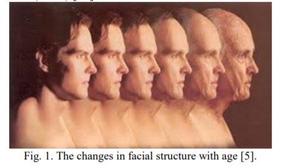

据我们所知，只有一项研究认为年龄对AFER的影响[8]，其他人对此进行了调查年龄范围受限制。 我们面临的主要挑战是不同表情的外观在不同年龄段的人

本文介绍了有关以下方面的初步结果面部表情识别考虑了年龄主题。 我们建议提取并使用形状，纹理，和外观功能使用众所周知的方法：主动形状模型（ASM）[9]，主动外观模型（AAM）[10，11]和本地二进制模式（LBP）[12]。使用内核支持向量对功能进行分类机器（SVM）[13]。

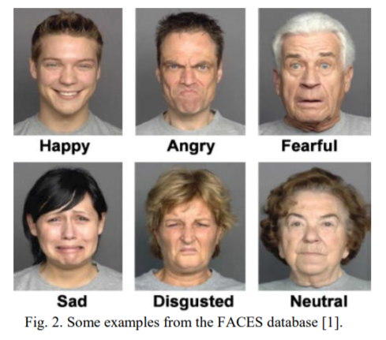

本文的提醒如下组织。 在第2节中，我们描述了本文使用的数据库。第三部分讨论了方法和框架。 部分4报告我们的实验结果，第5部分介绍结论和未来的工作。

## 2.数据库

在这项工作中使用了FACES数据库。 这个数据库涉及171个人，显示六种表情（愤怒，厌恶，恐惧，快乐，中立和悲伤）。 他们分为三个按年龄分组（年龄：19至31岁，中年：39-55岁，以及年龄较大的人：69-80）。 每个人
显示每个表达式的两个示例。 总共数据库由2052个正面图像组成[1]。 一些数据库中的示例如图2所示。请参见表1。有关FACES数据库的更多详细信息。

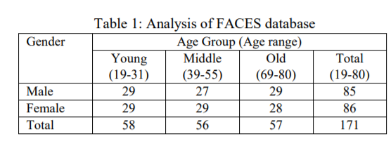

## 3.方法

表情是由肌肉的运动产生的。 这些不仅会导致形状变化，还会导致脸部的视觉外观。 因此应该通过分析形状可以对面部表情进行分类和/或纹理属性。 我们建议研究如何老化会影响脸部（形状和纹理）以及如何影响影响表情识别。

我们使用ASM来评估形状如何受到老化。 然后，我们采取了两种方法来评估面部外观：我们使用了AAM捕捉物体的形状和外观，并将其与结合了面部特征检测器和LBP的方法。图3显示了我们方法的主要元素，指示系统内的信息流。

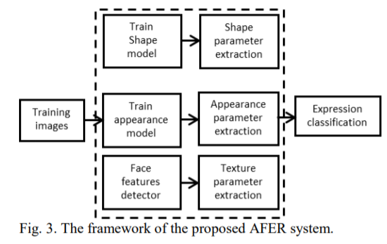

### A. Active Shape Model

我们首先建议对面孔的形状变化建模使用ASM。 它捕获了对象形状的可变性基于一组预先注释的训练图像，标有关键地标点的位置。 然后，任何有效形状都可以表示为有效值的组合变化模式[9]。 在本文中，模式的权重将用于对面部表情进行分类。 

使用两种方案标记了这些面部。 第一次使用根据Cootes的原始描述，在左侧获得了76分图4的图像。我们发现人脸形状很难在年龄较大的人群中准确描述，因此可以选择还使用了使用61点的方案（图的右图4）。

特定年龄的形状模型（SM）和一般的SM是使用两种标记方案创建的。 形状参数使用十倍交叉验证将其输入内核SVM评估模型的准确性

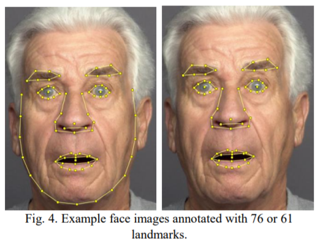

### B. Active Appearance Model 

我们建议使用的第二种方法是主动出现。 这将形状参数与包围界标的灰度分布结合在一起。 的外观模型（AM）提供了紧凑的统计信息面部形状和外观的表示图片，尽管外观仅在地标附近[10，11]。 同样，模型的参数可用于识别表达式

### C. Local Binary Pattern (LBP) 

我们建议的最终方法是LBP，这是一种常用方法量化纹理[12]。 它具有两个特性吸引人的纹理特征：它对任何单调灰度变化的不变性，例如 那些由照度变化及其计算简单性

最简单的形式是，像素的LBP由系统地将其价值与其八个邻居的价值进行比较价值观。 如果邻居大于1，则记录为1。像素。 八个值构成[0，255]中的值。 一个区域的特征在于LBP值请参见[12]。

我们用LBP提取特征的方法是

* 检测到脸部，然后眼睛和嘴巴使用中提琴琼斯探测器在面部区域内[14]
* 脸部，嘴巴和眼睛区域分为非重叠区域（图5）和LBP计算分布。 子直方图是为每个较小的区域计算并连接变成一个直方图

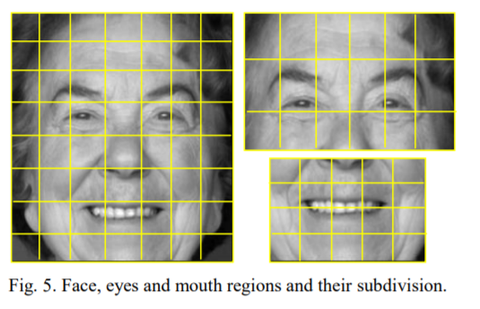

研究了两种代表面部的方案，一种使用整个人脸数据，另一种通过将眼睛和脸部区域分布有很大贡献面部表情。 同样，针对特定年龄段和通用模型被创造。 将要素分配给表达式类使用内核SVM并进行10倍交叉验证。

## 4实验结果

我们的实验涉及回答两个问题：如果年龄大了，表情识别会更有效吗使用特定型号？ 可以通过以下方法提高准确性排除可能不有助于面部的部分表情？

### A. Active Shape Model

建立了形状模型来代表每个年龄段，使用76和61个地标的整个数据集：总共4个模型使用76点，4个模型使用61点（每个年龄段一个，所有数据一个）。 图6、7和8显示了76点ASM Young模型的示例适合年轻，中级和旧数据，他们演示模型如何成功地适合正确的数据以及它如何丢失不正确的数据。 原因是通过使用模型的ASM实例只能以某种方式变形在训练集中找到。

我们进一步评估了模型的准确性识别表情。 提取的形状模型使用十重交叉验证对参数进行分类和内核SVM。 结果列于表2。76点模型和表3为61点模型。 它会可以看到针对特定年龄段的模型最适合对特征进行分类，尽管全局模型可以捕获数据中的所有变化。 61点模型是也许没有其他更好，但是它们更快计算。

总之，我们可以说老化对面部的形状并影响表情的准确性承认

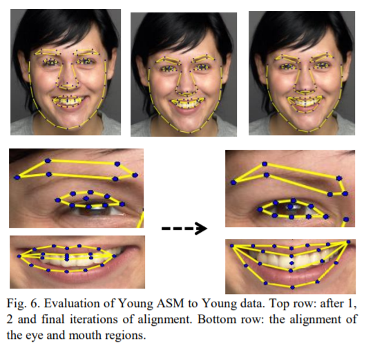

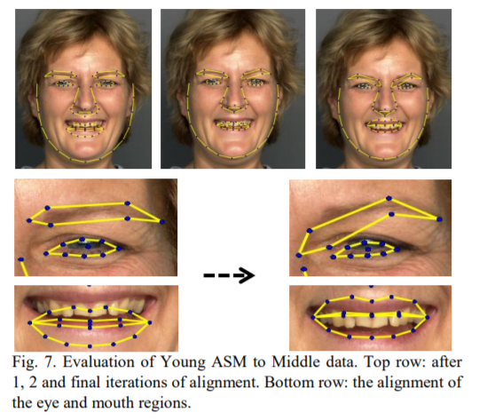

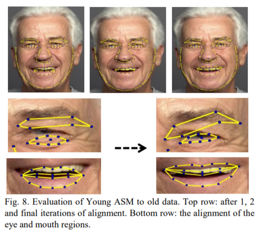

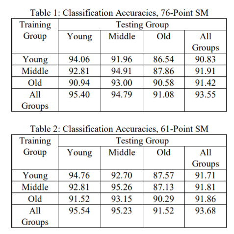

### B. Active Appearance Model Results 

外观模型（AM）添加纹理测量到SM。 图9说明了前三种变化模式61点模型。

与A部分一样，构建了八个外观模型，使用相同的方法对表达式进行分类像之前一样。 表3和表4给出了识别结果。

同样，在训练模型和在相同年龄段的受试者上进行测试。 也有两种模型之间的精度差异不大，但是61点模型明显较小，这表明未表示的数据无法提供有用的信息s信息。

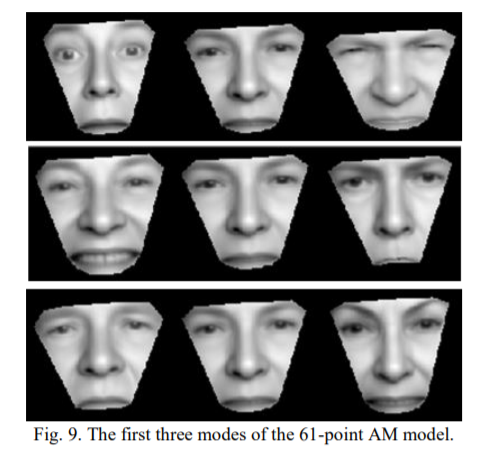

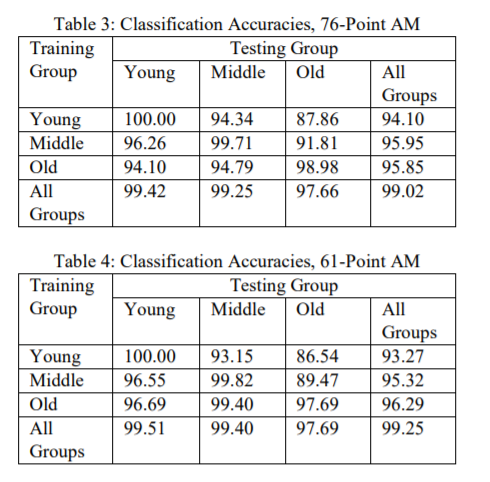

总之，我们可以说老化对面孔的外观并影响表情的准确性承认。

### C. Local Binary Pattern Results 

我们建议测试的假设是眼睛和嘴巴周围的区域将提供表情之间的区别以及整个面孔的区别。

如上所述，我们使用了Viola-Jones检测器[13]找到脸部，然后在每个眼睛和嘴巴图片。 脸部，眼睛和嘴巴被计算了。 LBP值的图像在图10.很明显，已经选择的已经超出了脸部并进入了背景或发际线。 这是不幸的结果具有矩形感兴趣区域的必要性。

同样，内核SVM分类器使用年轻，中间，老人和整个数据集和眼睛/嘴巴区域：总共八个分类器。 其通过十倍交叉验证再次评估准确性。结果列于表5和6。

显然，这种技术无法推广比外观模型。 很明显，特定年龄段的模型在其他年龄段。 但是，特定模型执行他们的目标年龄段非常好 有一个边缘通过使用面部补丁而不是整体来改善脸，这种改善可能会被斑块，包括不属于面部的区域。

总之，我们可以说老化对脸部的质地并影响表情的准确性承认

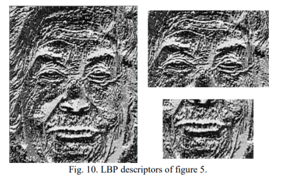

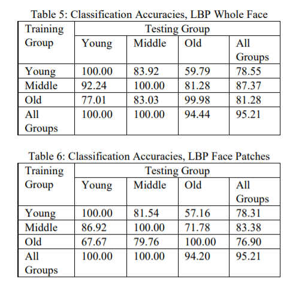

### D. Summary 

图11显示了组内精度。 由此我们得出结论，纯纹理测量能够假设我们使用特定年龄的模型，则可以准确地对表情进行分类。 这表明面部形状SM和AM中进行的测量不完全描述数据。

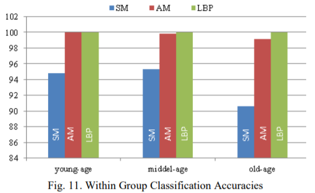

图12给出了使用模型获得的精度从整个数据集创建。 我们得出结论，AM是最能概括这些数据。

我们还比较了我们的方法和以前的方法工作[8]和人类观察者[1]。 表7总结了结果

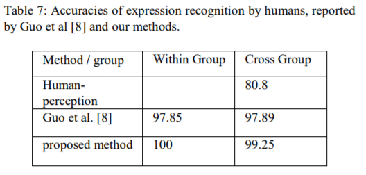

### E. Aging Effect Analysis 

所有实验的结果表明老化对表达式。 在本节中，我们尝试解释和分析其原因。

[15]声称表达式更改为的主要原因我们的年龄不仅存在皱纹，还存在导致面部肌肉弹性下降的原因改变面部外观。 例如，折叠脸颊和上唇之间可以出现在快乐年轻人的表达与老年人的中性表达人。 图13显示了LBP的响应，解释跨组表现不佳的某种方法分类器。

此外，检查了FACES中的所有图像数据库中我们发现大多数年轻人表现出更多表情比老年人夸张。 进一步，
有一些无关紧要的因素会影响一个人的表象并进一步混淆分类器。 这是一致的与心理学研究[16] [17]。 作为一个例子，见图14。

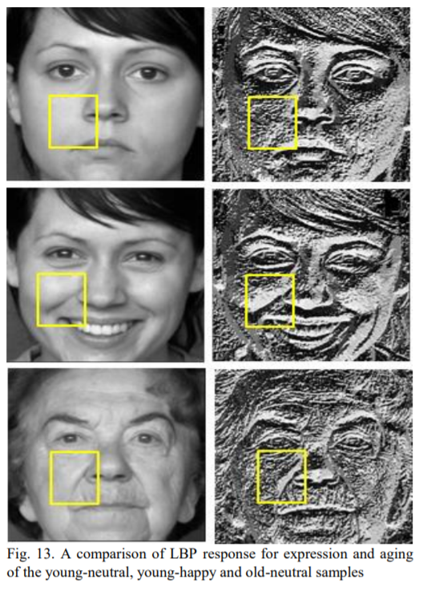

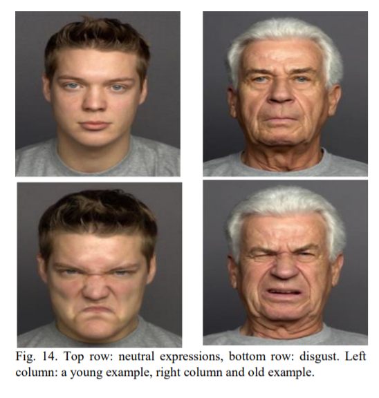

## 5.结论与未来工作

总之，这项研究的结果扩展了通过学习进行面部表情识别的研究衰老对面部表情识别的影响。 我们的实验强调应采取老化作用尝试识别表达式时的说明。 通过采取这考虑到了表情识别的解决方案更笼统，更有效

基于模型的方法，例如ASM，AAM和LBP已经提出来分析老化对面部特征的形状，质地和外观对表情识别性能的影响。通过这些方法得出的特征是从整个脸部以及我们相信的脸部斑点对表达负责。 我们的结果证明面部的形状，质地和外观功能在整个生命周期中逐渐变化。 因此，形状，纹理和外观以及老化对尝试识别它们时应考虑到它们表达。

我们已经使用了多类支持向量机研究比较提取的特征。 结果显示考虑到老化效果时的最高精度使用外观功能已实现帐户从AM，约99.25％。 LBP已成功识别在特定年龄段的表达准确率达100％。不使用面部特定区域的数据降低识别率，支持我们的假设被排除的区域对表达

我们打算进一步评估和量化结果系统地使用多种学习方法未来。 我们也打算研究自动估算年龄，结合年龄和表情识别系统。